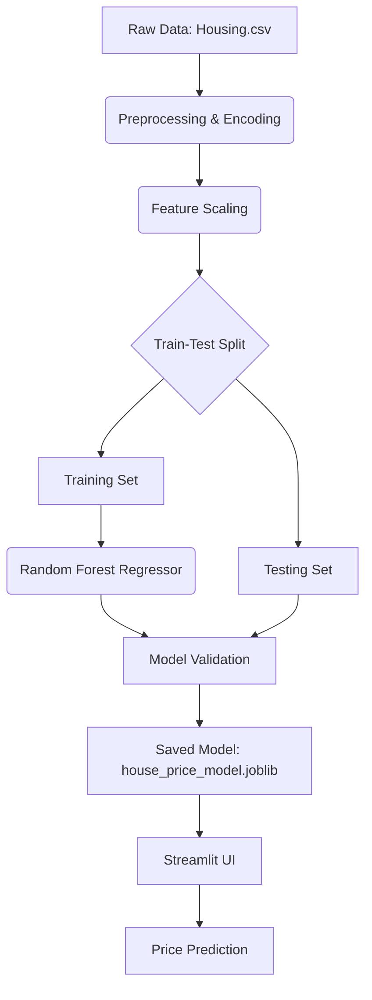

# Intelligent Property Price Prediction System

## Milestone 1: ML-Based Property Price Prediction

### 1. Problem Understanding
The real estate market is highly dynamic, with prices influenced by a complex interplay of spatial and structural factors. Predicting property values accurately is crucial for buyers, sellers, and investors. This project aims to build a machine learning pipeline to predict house prices based on features such as area, number of rooms, and available amenities.

### 2. Input-Output Specification
- **Inputs**:
    - `area`: Total surface area in square feet.
    - `bedrooms`: Number of bedrooms.
    - `bathrooms`: Number of bathrooms.
    - `stories`: Number of floors/stories.
    - `mainroad`: Proximity to the main road (Yes/No).
    - `guestroom`: Availability of a guest room (Yes/No).
    - `basement`: Presence of a basement (Yes/No).
    - `hotwaterheating`: Availability of hot water heating (Yes/No).
    - `airconditioning`: Presence of air conditioning (Yes/No).
    - `parking`: Number of parking spaces.
    - `prefarea`: Location in a preferred neighborhood (Yes/No).
    - `furnishingstatus`: Furnishing condition (Furnished, Semi-Furnished, Unfurnished).

- **Output**:
    - Estimated property price in INR (₹).

### 3. System Architecture


### 4. Model Performance Evaluation
The model was trained using a **Random Forest Regressor** with 100 estimators.

- **R² Score**: 0.6131
- **Mean Absolute Error (MAE)**: ₹ 1,024,146.54
- **Root Mean Squared Error (RMSE)**: ₹ 1,398,451.30

*Note: The performance reflects the baseline setup using basic feature engineering. Further improvements can be made by exploring more complex algorithms or advanced feature engineering.*

### 5. Running the Application
1. **Train the Model**:
   ```bash
   export PYTHONPATH=$PYTHONPATH:$(pwd)/src
   python3 src/train.py
   ```
2. **Launch UI**:
   ```bash
   streamlit run app/app.py
   ```
